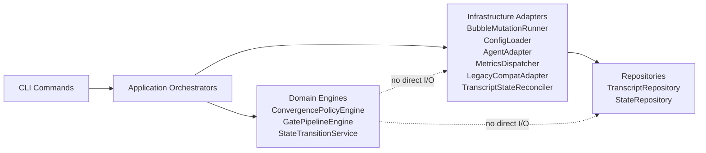
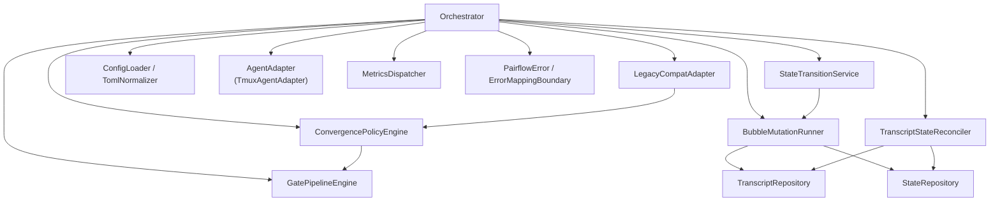
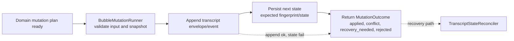
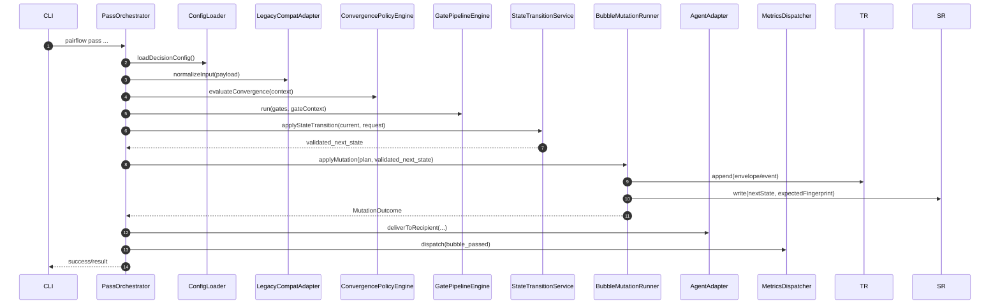
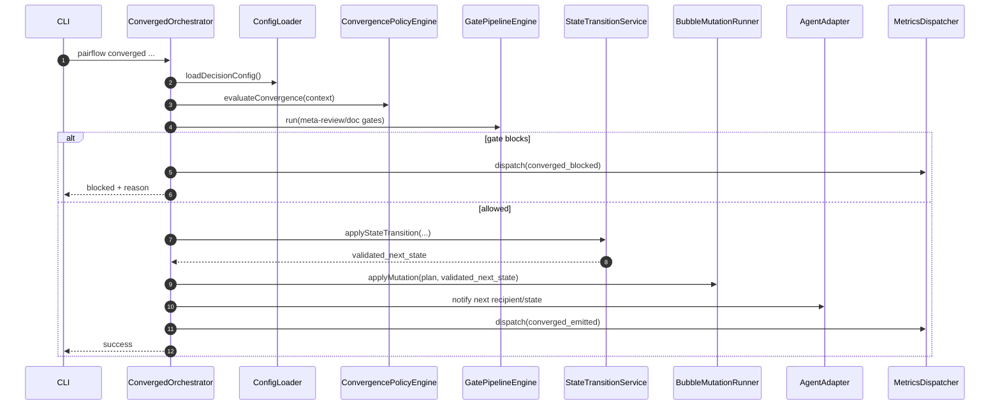
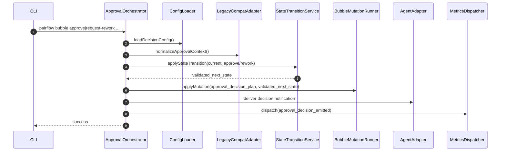
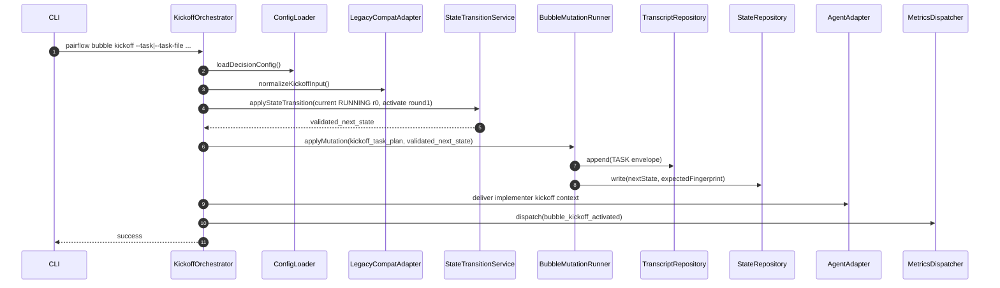
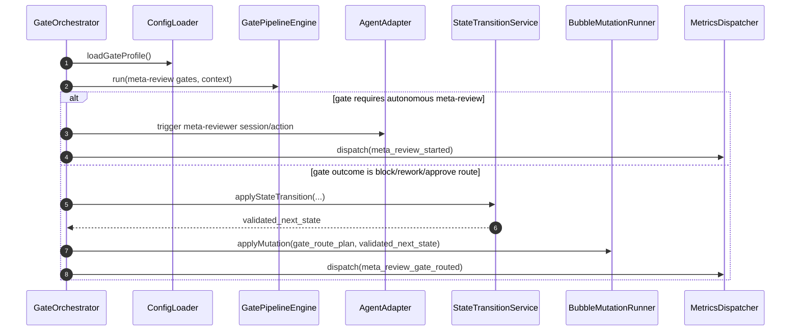
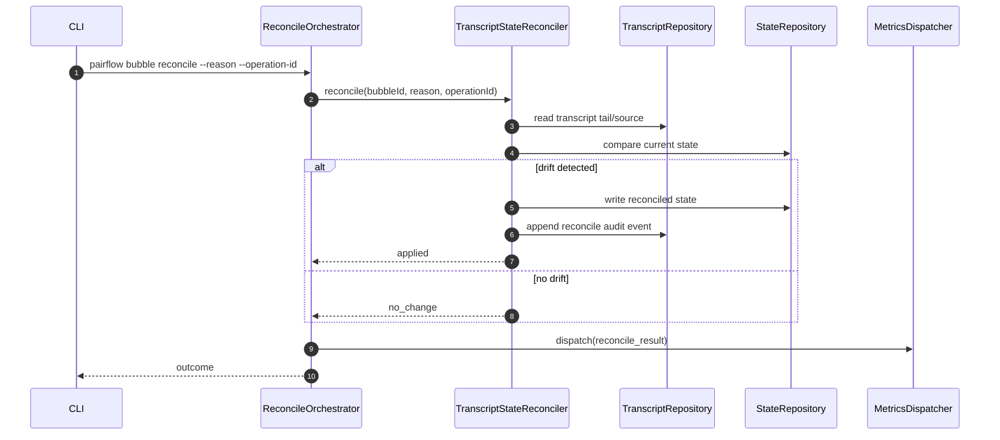

# M0 Component Visuals

Status: draft
Scope: M0 architecture understanding + one-pager validation

## 1) Layered view (who can call what)

## 2) M0 mandatory core component map

## 3) Mutation pipeline (transcript-first invariant)

## 4) Sequence: `pass`

## 5) Sequence: `converged`

## 6) Sequence: `approval`

## 7) Sequence: `kickoff` (ideation -> active task)

## 8) Sequence: `meta-review gate`

## 9) Sequence: `reconcile/recovery` (operator path)

## 10) Validation matrix (one-pagers vs key sequences)

| Component | pass | converged | approval | kickoff | meta-review gate | reconcile/recovery |
|---|---|---|---|---|---|---|
| BubbleMutationRunner | X | X | X | X | X | optional |
| StateTransitionService | X | X | X | X | X | optional |
| ConvergencePolicyEngine | X | X | - | - | - | - |
| GatePipelineEngine | X | X | - | - | X | - |
| TranscriptStateReconciler | - | - | - | - | - | X |
| PairflowError boundary | X | X | X | X | X | X |
| MetricsDispatcher | X | X | X | X | X | X |
| ConfigLoader + TomlNormalizer | X | X | X | X | X | X |
| AgentAdapter | X | X | X | X | X | - |
| LegacyCompatAdapter | X | optional | X | optional | optional | - |

## 11) How to use this doc during design review

1. Valassz egy sequence-et (pl. `pass`) es nezd meg, nincs-e tul sok komponens aktiv egyszerre.
2. Ellenorizd, hogy a policy dontes domainben marad-e, es I/O csak orchestrator/adapternel van-e.
3. Ha egy komponens tul sok sequence-ben tul sok fele szerepet kap, vedd elo az anti-goal blokkjat.
4. Minden uj valtoztatasnal frissitsd a megfelelo sequence diagramot es a matrixot.

## 12) Ownership closure criteria (StateTransitionService vs BubbleMutationRunner)

Green ownership akkor teljesul, ha mindharom csoport igaz:

1. Design-level szabaly:
   - `StateTransitionService` csak validal es `validated_next_state`-et ad vissza.
   - `BubbleMutationRunner` csak transcript append + state persist + mutation outcome.
   - `Orchestrator` csak koordinaciot vegez (`policy -> transition -> mutation`).
2. Code-level guard:
   - nincs kozvetlen `writeStateSnapshot` state-changing commandban (runneren kivul),
   - nincs manual `{ ...state, ... }` next-state epites normal flow-ban,
   - STS-ben nincs I/O import, BMR-ben nincs transition/policy szamitas.
3. Proof-level evidence:
   - `kickoff` + `pass` + `approval` flow mar a fenti lancot hasznalja,
   - legalabb egy teszt bizonyitja: STS hiba eseten nincs persist,
   - legalabb egy teszt bizonyitja: append ok + persist fail -> standard recovery outcome.
