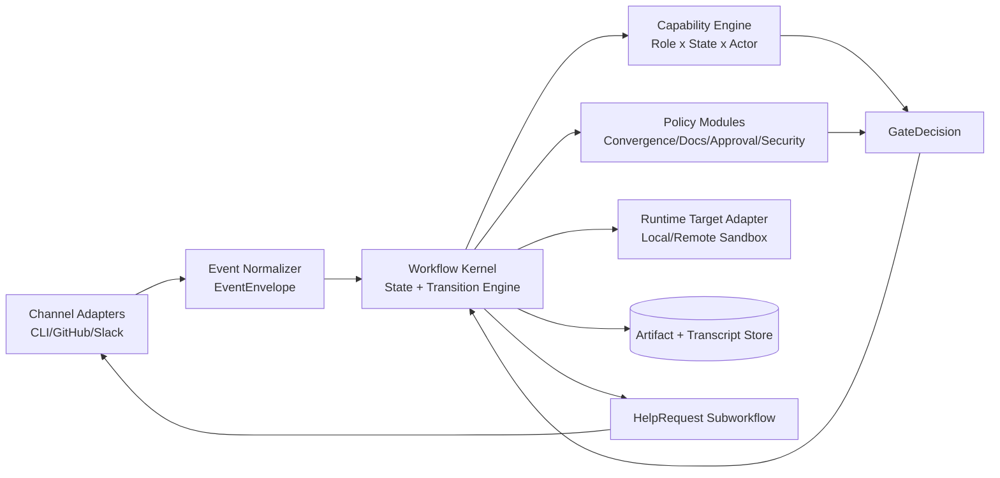

# Hivemind Learnings -> Pairflow v2

Dátum: 2026-03-07  
Forrásprojekt: `/Users/felho/dev/claude-hivemind`

## Cél
Gyors tanulságlista arról, mit érdemes átvenni a Hivemindből a Pairflow v2-be a `workflow kernel + channel adapterek` irányhoz.

## Adopt Now

1. Event-driven lifecycle routing hook/event alapon.
2. Stabil actor-azonosítás (`session_id` + `tty` + recovery logika).
3. Kötelező task-visibility gate (plan után ne lehessen „néma” implementálás).
4. Advisory file-conflict warning + változásnapló (low-cost, high-value).
5. Operability baseline: dashboard snapshot, debug logok, health-check + startup lock.

## Adapt Later

1. Wake-up mechanizmus
   - Hasznos minta, de adapterbe kell tenni (platformfüggő, best-effort).
2. Task/delegation protokoll
   - Jó behavior minta, de policy-modulként kell formalizálni.
3. Perzisztencia backend
   - A Hivemind Milvus modellje működőképes, de Pairflow-ban a state store maradjon cserélhető absztrakció mögött.
4. Statusline / UX injekció
   - Jó operatív visszajelzés, de ne legyen core orchestration dependency.

## Avoid

1. Policy logika szétszórása több hook/script/tool között (drift veszély).
2. Core logika platformspecifikus automatizmusra építése (pl. iTerm AppleScript).
3. Implicit jogosultságok
   - V2-ben explicit `CapabilityProfile` kell role+state alapon.
4. Túl sok ad-hoc állapotfrissítés egyetlen tool hívásban (audit és reprodukálhatóság romlik).

## V2 komponens-vázlat (minimal)

## Rövid mapping a meglévő first-idea docra

1. `EventEnvelope` <- event routing minták a Hivemindból.
2. `CapabilityProfile` <- implicit jogok helyett explicit gate.
3. `PolicyModule` <- hook-level szabályok kiváltása központi policy engine-re.
4. `HelpRequest` <- üzenet/delegation minta formalizált alfolyamattá.
5. `RuntimeTarget` <- local/remote futtatás adapteresítve.

## Következő minimál lépés (ha megyünk tovább)

1. Írjunk egy `workflow-template-v0` vázat (state-ek + transition guardok).
2. Definiáljuk a `capability-matrix-v0` táblát (Role x State x Action).
3. Nevesítsünk 3 induló policy modult: `convergence`, `docs_scope`, `approval_gate`.
