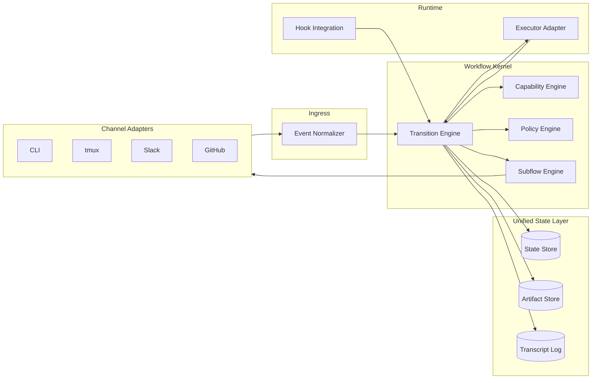
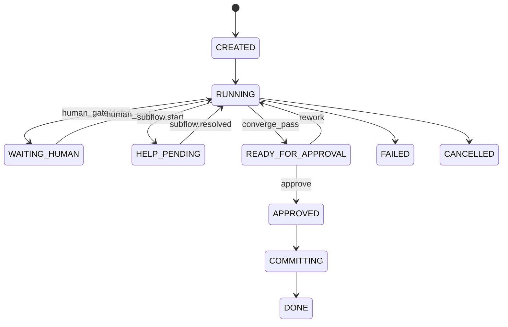
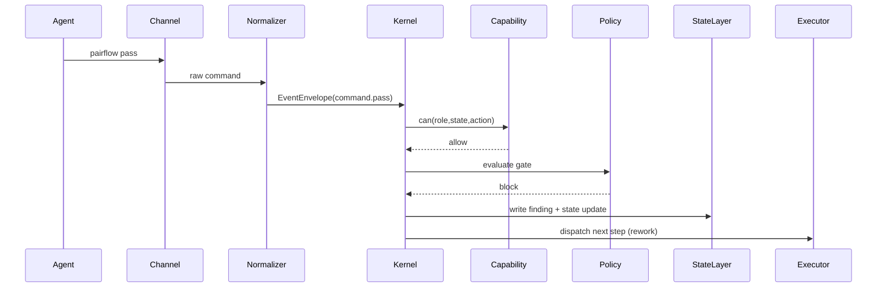
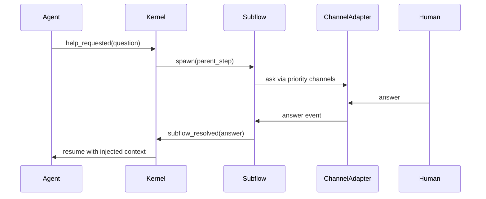

# Pairflow v2 Architecture Plan (Joint)

Status: draft (joint)
Date: 2026-03-07
Sources:
- `docs/v2/codex/pairflow-v2-architecture-plan.md`
- `docs/v2/claude/pairflow-v2-architecture-plan.md`

## 1. Cél

Ez a dokumentum a codex és claude v2 terv közös, konszolidált verziója.

Fő célok:

1. deklaratív workflow motor (nem hardcoded pipeline),
2. erős, explicit Boundary Contract réteg,
3. csatornafüggetlen (CLI/Slack/GitHub) működés,
4. biztonságos role/state alapú capability enforcement,
5. fokozatos, törésmentes v1 -> v2 migráció.

## 2. Tervezési alapelvek

1. **A workflow a főnök**: az agent stepet hajt végre, nem workflow-t irányít.
2. **Declare, don’t hardcode**: v1 is egy template preset legyen.
3. **Kernel dönt, adapter végrehajt**: policy/capability a kernelben, channel/hook csak végrehajt.
4. **Process (`WHEN`) és Gate (`WHAT`) szétválasztás**: routing és minőségellenőrzés külön réteg.
5. **Audit-first**: minden lényeges döntés és transition visszakövethető.

## 3. Egységes fogalmi modell

1. `WorkflowTemplate`: deklaratív definíció (`steps`, `gates`, `capability_profile`, `subflows`).
2. `WorkflowInstance`: futó bubble példány (`state`, `current_step`, `round`, `artifacts`).
3. `Step`: végrehajtási egység típus szerint.
4. `Gate`: döntési pont (`hard | human | llm-judge | composite`).
5. `PolicyModule`: gate-ekben futó független szabály.
6. `CapabilityProfile`: `(role, state, action) -> allow/deny`.
7. `EventEnvelope`: normalizált eseményszerződés minden csatornára.
8. `Subflow`: beágyazott alfolyamat (`help`, `escalation`).
9. `ExecutorAdapter`: local/remote futtatási absztrakció.
10. `StateLayer`: unified állapot + artifact + transcript API.

## 4. Komponens architektúra



## 5. Boundary Contractok

### 5.1 BC-01: Channel Adapter <-> Event Normalizer

Provider: `ChannelAdapter`  
Consumer: `EventNormalizer`

Input:
1. channel-native input (CLI command, Slack message, GH comment, stb.)

Output:
1. valid `EventEnvelope`

Garantált:
1. kernel csak normalizált eventet kap,
2. `source_channel` mindig kitöltött,
3. channel-specifikus payload nem szivárog a kernelbe.

Tiltott:
1. channel adapter nem módosíthat workflow state-et,
2. channel adapter nem hozhat policy döntést.

### 5.2 BC-02: Event Normalizer -> Kernel

Provider: `EventNormalizer`  
Consumer: `WorkflowKernel`

Input contract (minimum):

```yaml
event_id: evt_...
ts: "2026-03-07T15:20:00Z"
flow_id: flow_...
source_channel: cli
sender:
  actor_id: codex
  role: implementer
event_type: command.pass
payload: {}
correlation_id: corr_...
```

Output:
1. `accepted` vagy `rejected(reason)`

Garantált:
1. idempotens feldolgozás `event_id` alapján,
2. duplikált esemény nem okozhat dupla transitiont.

### 5.3 BC-03: Kernel -> Capability Engine

Provider: `WorkflowKernel`  
Consumer: `CapabilityEngine`

Input:
1. `role`,
2. `instance_state`,
3. `requested_action`.

Output:

```yaml
decision: allow | deny
reason_code: role_mismatch | state_mismatch | action_denied
```

Garantált:
1. deny esetén nincs side effect,
2. deny esemény auditálva van.

### 5.4 BC-04: Kernel -> Policy Engine

Provider: `WorkflowKernel`  
Consumer: `PolicyEngine`

Input:
1. gate id,
2. instance snapshot,
3. releváns artifactok.

Output:

```yaml
gate_decision:
  outcome: allow | block | defer
  reasons: []
  blocking_policies: []
```

Garantált:
1. policy modulok függetlenül futnak,
2. aggregáció determinisztikus,
3. `defer` kimenet explicit human/escalation útvonalat igényel.

### 5.5 BC-05: Kernel -> Transition Engine (belső szerződés)

Provider: `WorkflowKernel`  
Consumer: `TransitionEngine`

Feladat:
1. step routing,
2. round/loop kezelés,
3. subflow spawn/return,
4. state transition commit orchestration.

Garantált:
1. csak valid transition táblából léphet,
2. state update atomikus,
3. transitionhez kötelező transcript entry tartozik.

### 5.6 BC-06: Kernel -> Unified State Layer

Provider: `WorkflowKernel`  
Consumer: `StateLayer`

API minimum:
1. `get_state(instance_id)`
2. `set_state_atomic(instance_id, expected_version, new_state)`
3. `append_transcript(instance_id, event)`
4. `write_artifact(instance_id, artifact)`
5. `read_artifact(ref)`

Garantált:
1. compare-and-swap jellegű írás,
2. append-only transcript,
3. artifact típus és schema verzió ellenőrzés.

### 5.7 BC-07: Kernel -> Executor Adapter

Provider: `WorkflowKernel`  
Consumer: `ExecutorAdapter`

API minimum:
1. `provision(workspace_spec)`
2. `start_actor(runtime_handle, actor_config)`
3. `exec(runtime_handle, command, op_id)`
4. `sync(runtime_handle, direction)`
5. `health(runtime_handle)`
6. `resume(resume_token)`

Garantált:
1. executor nem írhat state-et közvetlenül,
2. op-id alapú idempotens parancs-végrehajtás,
3. reconnect után folytatható futás (ha runtime elérhető).

### 5.8 BC-08: Hook Integration <-> Kernel

Provider: `HookAdapter`  
Consumer: `WorkflowKernel`

Feladat:
1. kernel döntések végrehajtása PreTool/PostTool pontokon,
2. context injection (pending message, subflow answer, reminder).

Garantált:
1. hook nem dönt policy-ról, csak végrehajt,
2. hook deny döntéshez kernel reason-t ad vissza.

### 5.9 BC-09: Kernel -> Subflow Engine

Provider: `WorkflowKernel`  
Consumer: `SubflowEngine`

Input:
1. trigger event (`help_requested`),
2. parent step context,
3. channel priority.

Output:
1. `subflow_started`,
2. `subflow_resolved(answer_payload)` vagy `subflow_timeout`.

Garantált:
1. parent-step pause/resume konzisztens,
2. answer csak validált payloadként injektálható vissza.

## 6. Step típusok (joint taxonomy)

A joint modellben a step típusok explicit first-class primitívek:

1. `action`: egyszeri végrehajtás.
2. `loop`: ismétlődő ciklus gate feltételig / max round-ig.
3. `gate`: policy-alapú döntési step.
4. `human_gate`: kötelező emberi checkpoint.
5. `subflow`: beágyazott alfolyamat.
6. `parallel-human-queue`: item-alapú párhuzamos emberi döntéssor.

`parallel-step-loop` jelölt, de v2.0-ban opcionális/halasztható.

## 7. Állapotmodell



## 8. End-to-end működés (rövid)

### 8.1 Normál loop + approval



### 8.2 Help subflow



## 9. Konfigurációs példák

### 9.1 Joint v1 preset template

```yaml
template:
  id: pairflow-v1-joint

  capability_profile:
    implementer:
      RUNNING: [pass, ask-human, request-help]
    reviewer:
      RUNNING: [pass, ask-human, converged]
    operator:
      WAITING_HUMAN: [reply, stop, resume]
      READY_FOR_APPROVAL: [approve, request-rework, stop]

  steps:
    - id: review_loop
      type: loop
      max_rounds: 8
      steps:
        - id: implement
          type: action
          role: implementer
        - id: review
          type: action
          role: reviewer
      gate: converge_gate
      transitions:
        on_gate_pass: approval
        on_max_rounds: human_tiebreak

    - id: human_tiebreak
      type: human_gate
      transitions:
        on_approve: approval
        on_rework: review_loop

    - id: approval
      type: human_gate
      transitions:
        on_approve: commit
        on_rework: review_loop

    - id: commit
      type: action
      role: operator

  gates:
    - id: converge_gate
      gate_type: composite
      policies: [p0p1-block, p2-round-gate, test-pass, role-alternation]

  subflows:
    - id: help
      trigger: request-help
      channel_priority: [tmux, slack, github]
```

### 9.2 PolicyModule interface (joint)

```typescript
interface PolicyResult {
  outcome: "allow" | "block" | "defer";
  reason: string;
  details?: Record<string, unknown>;
}

interface PolicyModule {
  id: string;
  evaluate(context: PolicyContext): PolicyResult | Promise<PolicyResult>;
}
```

## 10. Mi van benne v2.0-ban és mi nincs

### Benne v2.0

1. Workflow template + v1 preset.
2. Capability matrix enforcement.
3. Policy engine (`allow/block/defer`).
4. Unified state API + append-only transcript.
5. Help subflow alapverzió.
6. Local executor + reconnect-ready executor contract.

### Nincs benne v2.0

1. Full SDLC orchestration scope.
2. Parallel-step dependency scheduler élesben.
3. Teljes trust calibration/intelligence layer.
4. Team/multi-user/cloud sync stack.

## 11. Migrációs terv

1. `v2.0-alpha`: v2 kernel + v1 preset párhuzamosan fut, opt-in.
2. `v2.0`: jelenlegi CLI parancsok EventEnvelope wrapperként a v2 kernelt hívják.
3. `v2.1`: custom templatek és extra stage típusok fokozatos engedélyezése.
4. `v2.2+`: optional llm-judge/trust profile és fejlettebb parallel scheduler.

## 12. Rövid döntési összefoglaló

1. Joint döntés: kernel-first, template-driven, boundary-contract centrikus v2.
2. Joint döntés: hook/channel enforcement végrehajtói réteg, nem policy logika.
3. Joint döntés: v2.0 cél a v1 viselkedés új motoron, nem full új termék scope.
