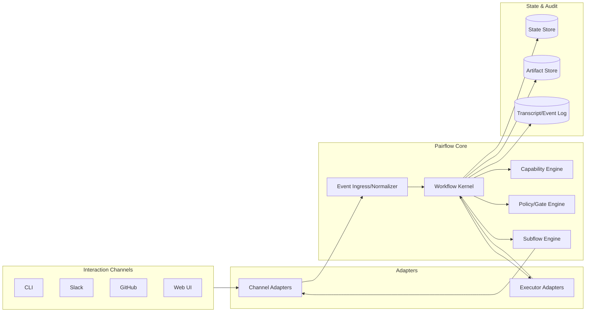
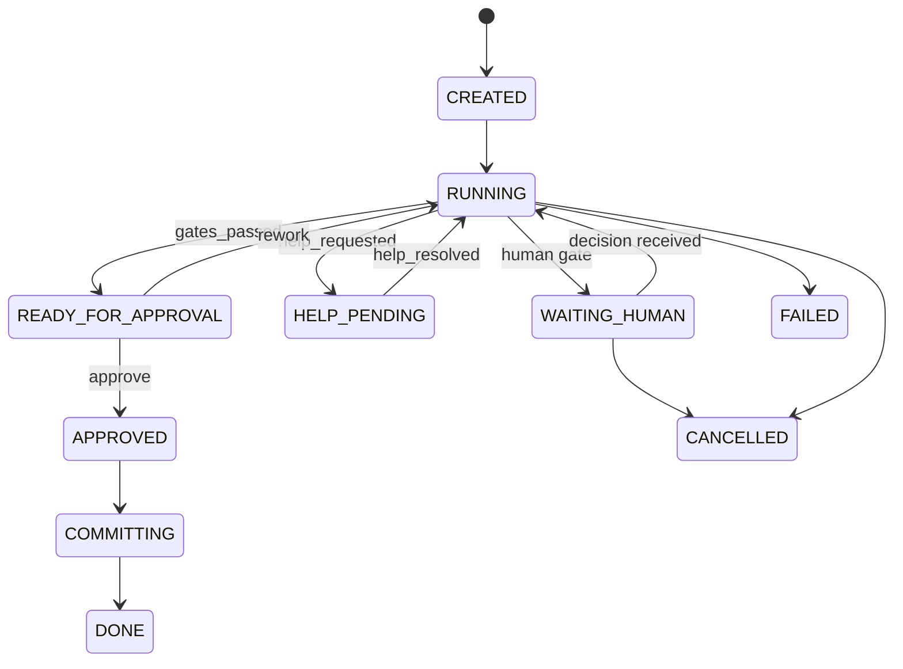
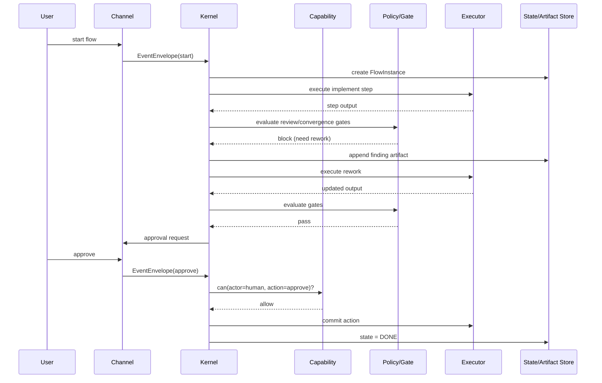
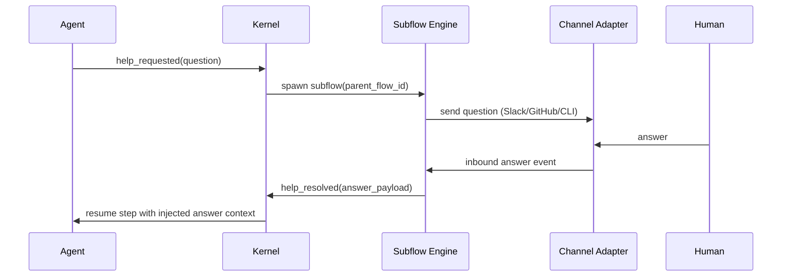
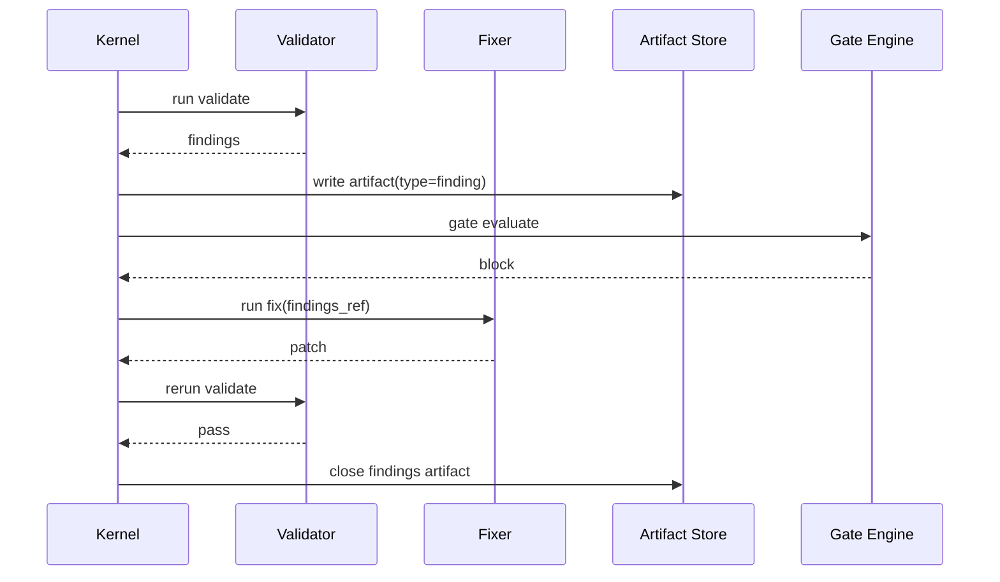

# Pairflow v2 Architecture Plan

Status: draft  
Date: 2026-03-07  
Owner: codex-v2 working draft

## 1. Cél és fókusz

Ez a terv a Pairflow v2 architektúrát írja le úgy, hogy:

1. a rendszer maradjon egyszerűen érthető,
2. a workflow logika legyen rugalmasan bővíthető,
3. a **Boundary Contract** réteg legyen explicit és stabil.

Nem cél most teljes, implementációs mélységű technikai specifikációt adni.  
Fókusz: fogalmi modell + működési szerződések + jól követhető ábrák.

## 2. V2 tervezési elvek

1. **Kernel-first orchestration**: a workflow állapot és döntés a kernelben történik.
2. **Headless + channel-agnostic**: CLI/Slack/GitHub csak adapter, nem core logika.
3. **Policy modularitás**: gate/policy szabályok külön modulokban, nem monolitban.
4. **Capability-first safety**: minden akció role+step/state alapú jogosultság-ellenőrzésen megy át.
5. **Auditability by design**: esemény, döntés, artifact visszakereshető legyen.
6. **Evolvability**: session-store/intelligence/team layer később hozzáadható legyen migrációs törés nélkül.

## 3. Fogalmi modell

1. `WorkflowTemplate`: deklaratív workflow definíció (step-ek, átmenetek, gate-ek, role-scope).
2. `FlowInstance`: futó példány (mai bubble), runtime state + context + references.
3. `Step`: végrehajtási egység (`sequential | loop | parallel-human-queue | action`).
4. `Gate`: blokkpont (`hard | human | llm-judge | composite`).
5. `PolicyModule`: kiértékelhető szabálymodul, amely gate döntést ad.
6. `CapabilityProfile`: role+step/state alapú allow/deny policy.
7. `EventEnvelope`: normalizált bejövő/kimenő esemény-szerződés.
8. `Artifact`: strukturált munkatermék (`message`, `finding`, `review_pack`, stb.).
9. `ChannelAdapter`: kommunikációs adapter (CLI, Slack, GitHub, Webhook).
10. `ExecutorAdapter`: futtatási adapter (local worktree, SSH, container, cloud sandbox).
11. `HelpSubflow`: bármely step-ből indítható segítségkérő alfolyamat.

## 4. Komponens architektúra (magas szint)



## 5. Boundary Contract modell

Boundary Contract = egy komponenshatár explicit szerződése:

1. ki a provider és consumer,
2. mi az input/output forma,
3. milyen invariánsok garantáltak,
4. hogyan néz ki a hiba és retry viselkedés.

### 5.1 Contract mátrix

| ID | Boundary | Provider | Consumer | Kulcs garancia |
|---|---|---|---|---|
| BC-01 | WorkflowTemplate -> Kernel | Template Loader | Workflow Kernel | validált, versionált template |
| BC-02 | Channel -> Ingress | Channel Adapter | Event Ingress | normalizált EventEnvelope |
| BC-03 | Ingress -> Kernel | Event Ingress | Workflow Kernel | deduplikált, idempotens command dispatch |
| BC-04 | Kernel -> Capability | Workflow Kernel | Capability Engine | determinisztikus allow/deny |
| BC-05 | Kernel -> Gate/Policy | Workflow Kernel | Policy Engine | strukturált gate döntés okkal |
| BC-06 | Kernel -> State Store | Workflow Kernel | State Store | atomikus state transition |
| BC-07 | Kernel -> Artifact Store | Workflow Kernel | Artifact Store | típusos artifact írás/olvasás |
| BC-08 | Kernel -> Executor | Workflow Kernel | Executor Adapter | standard exec/provision contract |
| BC-09 | Kernel -> Channel | Workflow Kernel | Channel Adapter | delivery status + correlation |
| BC-10 | Kernel -> Help Subflow | Workflow Kernel | Subflow Engine | parent-child flow linking |

### 5.2 BC-01: WorkflowTemplate -> Kernel

**Input contract**

```yaml
template_id: pairflow-v1-preset
template_version: 0.1.0
steps: [...]
transitions: [...]
gates: [...]
capability_profiles: [...]
```

**Output contract**

1. `TemplateLoadResult.accepted=true` vagy
2. `TemplateLoadResult.accepted=false` + validációs hibák listája.

**Invariánsok**

1. minden transition létező step-re mutat,
2. nincs unreachable start-state,
3. gate hivatkozás csak regisztrált gate típusra mutathat.

**Hibakezelés**

1. validation error -> `template_rejected`,
2. parse error -> `template_invalid_format`.

### 5.3 BC-02: Channel -> Ingress

**Input contract (`EventEnvelope`)**

```yaml
event_id: evt_...
ts: "2026-03-07T13:00:00Z"
flow_id: flow_...
channel: cli
actor_id: codex
actor_role: implementer
event_type: command.invoked
payload:
  command: pass
correlation_id: corr_...
```

**Output contract**

1. Normalized event kernel-kompatibilis mezőkkel.
2. Deduplikációs döntés (`accepted` vagy `duplicate_ignored`).

**Invariánsok**

1. `event_id` egyedi,
2. `flow_id` kötelező runtime eseménynél,
3. `event_type` whitelistelt.

**Retry/idempotencia**

1. azonos `event_id` újraküldhető, nem okozhat dupla transitiont.

### 5.4 BC-03: Ingress -> Kernel command dispatch

**Garancia**

1. Kernel csak normalizált eventet kap.
2. Minden dispatch-hez tartozik trace/correlation az event logban.

**Hiba**

1. ismeretlen flow -> `flow_not_found`,
2. lezárt flow -> `flow_not_active`,
3. tiltott transition -> `transition_denied`.

### 5.5 BC-04: Kernel -> Capability Engine

**Input**

1. `flow_state`,
2. `active_step`,
3. `actor_role`,
4. `requested_action`.

**Output**

```yaml
decision: allow | deny
reason_code: capability_denied | role_mismatch | state_mismatch
```

**Invariánsok**

1. deny esetén kernel nem végez side effectet,
2. minden deny esemény auditált.

### 5.6 BC-05: Kernel -> Gate/Policy Engine

**Input**

1. step kimenetek,
2. releváns artifact referenciák,
3. policy context (`round`, `risk_mode`, `docs_only`, stb.).

**Output**

```yaml
gate_result:
  status: pass | block | defer
  findings:
    - code: p1_open
      severity: P1
      message: "Open critical finding"
```

**Invariánsok**

1. `block` mindig indokolt findings listával jön,
2. `defer` csak explicit human checkpoint esetén engedett.

### 5.7 BC-06: Kernel -> State Store

**Kontraktus**

1. `compare-and-swap` jellegű atomikus transition írás.
2. Last-known state snapshot és transition event együtt mentődik.

**Invariánsok**

1. állapot csak valid transition táblából léphet,
2. minden állapotváltás monotonic timestampet kap.

### 5.8 BC-07: Kernel -> Artifact Store

**Artifact contract minimum**

```yaml
artifact_id: art_...
flow_id: flow_...
step_id: validate
artifact_type: finding
schema_version: 1
created_by: validator
content_ref: path_or_inline_ref
```

**Invariánsok**

1. artifact típus schema-hoz kötött,
2. flow-hoz nem tartozó artifact nem hivatkozható.

### 5.9 BC-08: Kernel -> Executor Adapter

**Input contract**

1. `provision(workspace_spec)`,
2. `exec(handle, command, timeout)`,
3. `sync(handle, direction)`,
4. `health(handle)`.

**Output contract**

```yaml
status: ok | timeout | infra_error
exit_code: 0
stdout_ref: ...
stderr_ref: ...
```

**Invariánsok**

1. executor nem írhat workflow state-be közvetlenül,
2. csak kernel kérésére történhet side effect.

### 5.10 BC-09: Kernel -> Channel Adapter

**Kontraktus**

1. `send(message, recipient, correlation_id) -> delivery_id`
2. `delivery_status(delivery_id) -> delivered | pending | failed`

**Invariánsok**

1. csatorna hiba nem törheti a kernel state integritását,
2. sikertelen kézbesítés retry queue-ba kerül.

### 5.11 BC-10: Kernel -> Help Subflow

**Kontraktus**

1. parent flow step-ből `help_requested` event indít alfolyamot,
2. subflow válasza `help_resolved` eventtel visszacsatolódik,
3. parent context-be csak validált answer payload injektálható.

**Invariánsok**

1. parent flow-id és subflow-id összekapcsolt,
2. válasz nélkül nincs automatikus „success” visszatérés.

## 6. Állapotmodell



## 7. Működési folyamatok (sequence ábrák)

### 7.1 Normál implement-review-approval ciklus



### 7.2 Help subflow (csatornafüggetlen)



### 7.3 Validate -> Fix findings minta



## 8. Példák

### 8.1 WorkflowTemplate példa (v1 preset v2 formában)

```yaml
workflow_id: pairflow-v1-preset
version: 0.1.0

steps:
  - id: implement
    type: sequential
    role: implementer
    action: execute_changes
    on_success: review

  - id: review
    type: sequential
    role: reviewer
    action: review_changes
    gate: convergence_gate
    on_block: implement
    on_pass: approval

  - id: approval
    type: action
    role: human
    action: human_approval
    on_approve: commit
    on_rework: implement

  - id: commit
    type: action
    role: operator
    action: commit_and_close

gates:
  - id: convergence_gate
    gate_type: composite
    policies: [p0p1_block, p2_round_rule, test_pass]
```

### 8.2 CapabilityProfile példa

```yaml
capability_profile:
  implementer:
    implement:
      allow: [pass, ask_human, request_help]
      deny: [approve, converged, delete_flow]
  reviewer:
    review:
      allow: [pass, converged, request_help]
      deny: [delete_flow]
  human:
    approval:
      allow: [approve, rework, cancel]
```

### 8.3 EventEnvelope minimum mezők

```yaml
event_id: evt_01
flow_id: flow_01
step_id: review
actor_id: claude
actor_role: reviewer
event_type: command.converged
correlation_id: corr_771
causation_id: evt_00
model_id: claude-sonnet-202602
ts: "2026-03-07T14:00:00Z"
payload: {}
```

## 9. V1 -> V2 migrációs terv (boundary-first)

### Phase A: Contract freeze

1. `workflow-template-v0.1` forma lezárása.
2. `event-envelope-v0.1` minimum mezők lezárása.
3. `capability-matrix-v0.1` lezárása.

### Phase B: Kernel extraction

1. CLI command útvonalból kernel command dispatch központosítása.
2. Capability és policy hívások egységesítése.
3. State transition atomikussá tétele.

### Phase C: Stage/gate bővítés

1. `parallel-human-queue` bevezetése.
2. Findings artifact standardizálása validate-fix ciklushoz.
3. Help subflow channel routing.

### Phase D: Runtime adapter bővítés

1. LocalExecutor stabilizálás.
2. SSH/remote executor prototípus.
3. Retry/reconnect policy formalizálás.

## 10. Kockázatok és mitigációk

1. **Túl korai komplexitás**  
Mitigáció: phase-based rollout, contract freeze előtt nincs feature expand.

2. **Policy spagetti visszacsúszás**  
Mitigáció: minden új szabály csak PolicyModule-ként kerülhet be.

3. **Channel-specifikus logika beszivárgása a core-ba**  
Mitigáció: adapter boundary kötelező, kernel csak EventEnvelope-t ismer.

4. **Remote executor inkonzisztencia**  
Mitigáció: explicit sync/health contract + idempotens step retry.

## 11. Rövid döntési összefoglaló

1. V2 magja: `Workflow Kernel + Boundary Contracts`.
2. Első szállítási cél: v1 preset futtatható legyen v2 template-en.
3. Kötelező minőségi kritérium: minden fő boundary-n explicit input/output + hiba + invariáns dokumentálva.
