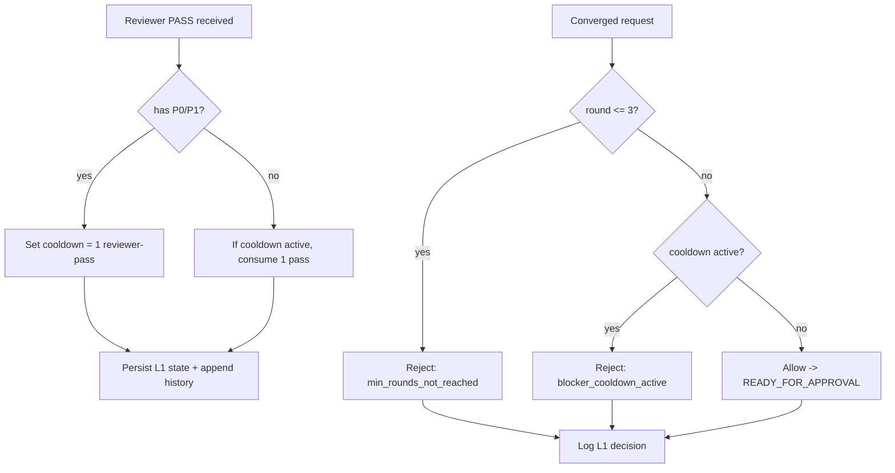
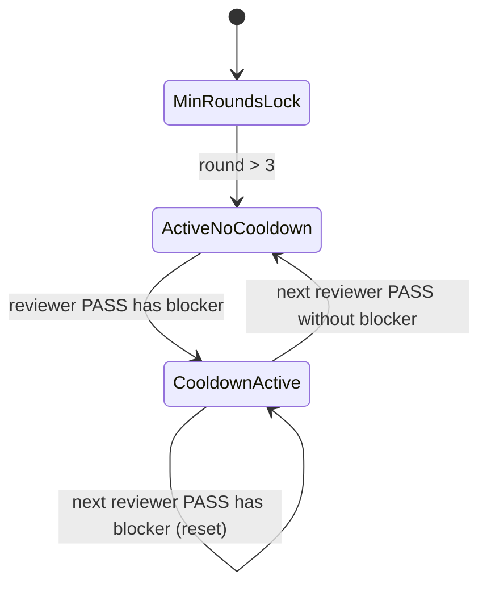
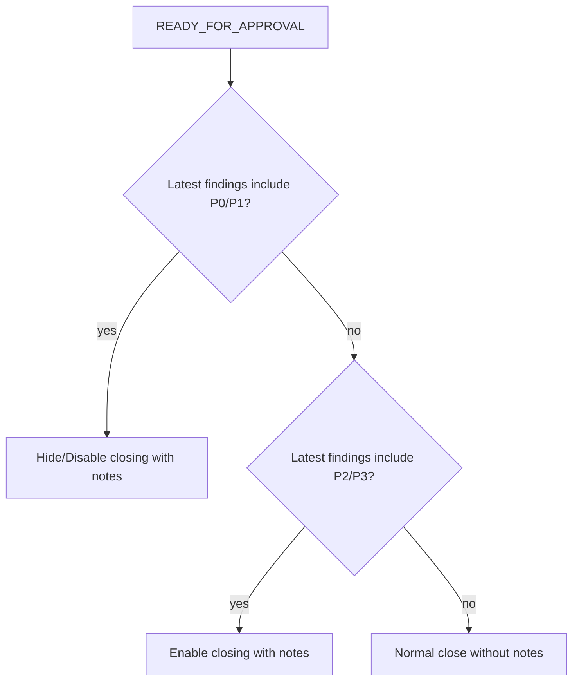

# Task: Convergence Readiness + Closure with Notes Policy (Phase 1)

## Goal

Legyen egyértelműen elkülönítve:

1. mikor engedhető egyáltalán `converged` (Convergence Readiness Gate),
2. mikor engedhető a `closing with notes` kártya (Closure with Notes Policy).

Emellett minden döntés oka maradjon auditálható bubble törlés után is.

## Context

A jelenlegi tapasztalat szerint két külön problémát kell szétválasztani:

1. **Korai convergence**: túl hamar kerül a bubble emberi jóváhagyási szakaszba.
2. **Lezárás maradék findingokkal**: még ha konvergált is, nem mindegy, hogy milyen findingok maradtak.

Az is cél, hogy kapjunk extra reviewer compute-ot ott, ahol ez minőségjavulást adhat:

1. minimum 3 review kör legyen kötelező,
2. P0/P1 után legyen kötelező extra reviewer-pass,
3. P2/P3-only esetnél a `closing with notes` explicit policy alapján dőljön el.

## Policy Spec (Required)

### Definitions

1. `blocker finding`: bármely `P0` vagy `P1` finding reviewer PASS-ban.
2. `non-blocker notes`: olyan reviewer PASS finding készlet, ahol van legalább egy `P2` vagy `P3`, de nincs `P0/P1`.
3. `minimum review rounds`: az első 3 round alatt (`round <= 3`) nem engedünk `converged`-et.
4. `reviewer pass index`: monoton növekvő számláló minden reviewer PASS-ra.

### L1: Convergence Readiness Gate

1. `round <= 3` esetén minden `converged` kísérlet `rejected` (`reason_code: min_rounds_not_reached`).
2. `round >= 4` esetén:
   - ha reviewer PASS-ban `P0/P1` van, aktiválódik 1 reviewer-pass cooldown,
   - aktív cooldown alatt `converged` `rejected` (`reason_code: blocker_cooldown_active`),
   - a következő reviewer PASS elfogyasztja a cooldown-t,
   - ha ebben a PASS-ban újra van `P0/P1`, a cooldown újraindul.
3. Minden `converged` kísérletnél kötelező explicit gate-evaluáció:
   - `allowed`, vagy
   - `rejected` `reason_code`-dal.

### L2: Closure with Notes Policy

1. `closing with notes` csak akkor lehet elérhető, ha az L1 már `allowed`.
2. Ha az utolsó reviewer finding készlet tartalmaz `P0/P1`-et, a `closing with notes` tiltott.
3. Ha az utolsó reviewer finding készlet `non-blocker notes` (csak `P2/P3`), a `closing with notes` engedhető.
4. Ha nincs finding, normál lezárás mehet notes nélkül.

## Visual Flow (Mermaid)

## Data Model Changes (Required)

`state.json` kapjon explicit, kétkapus runtime mezőket (név finomítható implementáció közben, szemantika kötelező):

1. `review_gate.minimum_rounds` (default: `3`)
2. `review_gate.reviewer_pass_index` (int, monotonic)
3. `review_gate.last_blocker_reviewer_pass_index` (int|null)
4. `review_gate.cooldown_active` (boolean)
5. `review_gate.cooldown_remaining_reviewer_passes` (Phase 1: `0` vagy `1`)
6. `review_gate.last_convergence_readiness_decision`:
   - `allowed|rejected`
   - `reason_code` (`min_rounds_not_reached`, `blocker_cooldown_active`, `ready`)
   - `evaluated_at`
   - `evaluated_on_round`
7. `review_gate.latest_finding_counts`:
   - `p0`, `p1`, `p2`, `p3`
8. `review_gate.last_closure_with_notes_eligibility`:
   - `eligible: boolean`
   - `reason_code` (`blocked_by_p0_p1`, `eligible_p2_p3_only`, `no_findings`)
   - `evaluated_at`

## Persistency + Archive Requirements (Required)

### Why

A két kapu döntése akkor mérhető/elemezhető, ha bubble törlés után is visszakereshető:

1. mikor volt `P0/P1`,
2. mikor volt aktív cooldown,
3. mikor és miért lett `converged` tiltva/engedve,
4. mikor és miért volt `closing with notes` tiltva/engedve.

### What to persist

Minden releváns gate eseményt append-only formában írjunk egy bubble-local history fájlba:

1. `artifacts/review-gate-history.ndjson`

Ajánlott eseménytípusok:

1. `reviewer_pass_recorded` (`finding_counts`, `has_blocker`, `reviewer_pass_index`)
2. `convergence_readiness_evaluated` (`allowed/rejected`, `reason_code`, `cooldown_active`, `round`)
3. `closure_with_notes_eligibility_evaluated` (`eligible`, `reason_code`, `round`)

### Archive inclusion

A delete előtti archive snapshot scope bővüljön úgy, hogy az alábbi fájl is archiválódjon, ha létezik:

1. `artifacts/review-gate-history.ndjson`

## Scope Boundaries

### In Scope (Required)

1. L1 gate logika implementálása reviewer PASS + converged útvonalban.
2. L2 closure policy implementálása (eligibility számítás + UI/API kitettség, ahol releváns).
3. `state.json` gate mezők bevezetése és karbantartása.
4. Gate history artifact írása (`artifacts/review-gate-history.ndjson`).
5. Archive snapshot allowlist bővítése a gate history fájllal.
6. Unit/integration tesztek.

### Out of Scope (Phase 1)

1. P2/P3 alapú extra cooldown policy (L1-ben).
2. Többszintű (1-nél nagyobb) cooldown.
3. UI analytics dashboard bővítés (vizualizáció).
4. Automatikus migráció régi bubble state-ekre tömeges batch eszközzel.

## Suggested Implementation Touchpoints

1. `src/core/agent/pass.ts`
2. `src/core/agent/converged.ts`
3. `src/core/state/stateSchema.ts`
4. `src/core/state/transitions.ts` (ha szükséges)
5. `src/core/archive/archiveSnapshot.ts`
6. `src/core/ui/presenters/bubblePresenter.ts`
7. `src/core/ui/router.ts` (ha closure eligibility API oldalon kell)
8. új helper modul: `src/core/reviewer/convergenceReadinessGate.ts`
9. új helper modul: `src/core/reviewer/reviewGateHistory.ts`

## Acceptance Criteria (Binary)

1. `round <= 3` alatt minden `converged` kísérlet `rejected` (`reason_code: min_rounds_not_reached`), severity-től függetlenül.
2. `round >= 4` alatt `P0/P1`-es reviewer PASS után aktív cooldown mellett `converged` `rejected` (`reason_code: blocker_cooldown_active`).
3. Ha blocker utáni reviewer PASS tiszta, utána `converged` újra engedhető.
4. Ha blocker utáni reviewer PASS újra blocker, a cooldown újraindul.
5. `closing with notes` nem elérhető, ha az utolsó reviewer finding készletben van `P0/P1`.
6. `closing with notes` elérhető, ha az L1 gate enged és az utolsó finding készlet `P2/P3-only`.
7. `state.json` új mezők determinisztikusan frissülnek minden reviewer PASS/converged/closure-eligibility döntésnél.
8. `artifacts/review-gate-history.ndjson` tartalmazza a reviewer pass + L1 + L2 döntés eseményeket.
9. Bubble delete után az archive snapshot tartalmazza a `artifacts/review-gate-history.ndjson` fájlt (ha létrejött).
10. Minden új/érintett viselkedésre van célzott teszt.

## Test Mapping

1. **Gate logic unit tests**
   - min rounds lock (`round <= 3` -> reject converged)
   - blocker -> cooldown active
   - cooldown consume on next reviewer pass
   - blocker during cooldown -> cooldown reset
2. **Converged path tests**
   - reject during cooldown with explicit reason code
   - allow outside cooldown
3. **Closure policy tests**
   - P0/P1 present -> closing with notes ineligible
   - P2/P3-only -> closing with notes eligible (if L1 allows)
   - no findings -> normal close path
4. **Persistence tests**
   - state gate fields updated as expected
   - review-gate-history append format valid NDJSON
5. **Archive tests**
   - snapshot includes review-gate-history when file exists
   - missing optional file does not fail archive creation

## Deliverables

1. Implementált L1 (`Convergence Readiness`) és L2 (`Closure with Notes`) policy.
2. Tartós gate history artifact.
3. Archive scope bővítés a gate history fájllal.
4. Frissített dokumentáció (minimum README vagy releváns design doc rövidítés).
5. Zöld tesztek az érintett területen.

## Open Questions

1. Phase 1-ben kell-e külön config mező (`bubble.toml`) a minimum round számhoz, vagy hardcoded `3` legyen?
2. A gate history eseményeket külön metrics eventként is írjuk-e azonnal, vagy Phase 1-ben elég a bubble-local artifact + transcript?
